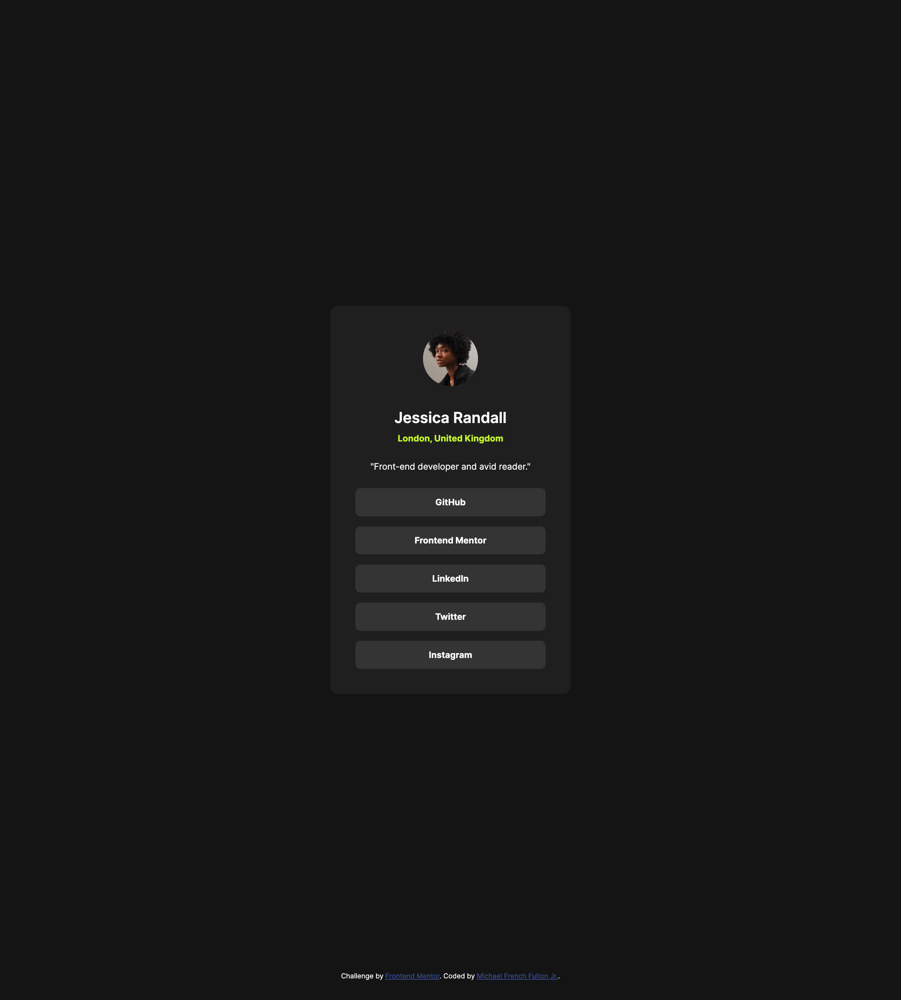

# Frontend Mentor - Social links profile solution

This is a solution to the [Social links profile challenge on Frontend Mentor](https://www.frontendmentor.io/challenges/social-links-profile-UG32l9m6dQ). Frontend Mentor challenges help you improve your coding skills by building realistic projects. 

## Table of contents

- [Overview](#overview)
  - [The challenge](#the-challenge)
  - [Screenshot](#screenshot)
  - [Links](#links)
- [My process](#my-process)
  - [Built with](#built-with)
  - [Continued development](#continued-development)
  - [Useful resources](#useful-resources)
- [Author](#author)

## Overview

### The challenge

Users should be able to:

- See hover and focus states for all interactive elements on the page

### Screenshot

.png)

### Links

- Live Site URL: [Github Pages](https://frenchfulton94.github.io/Social-Links-Frontend-Project/)

## My process

1. Determine the structure of the page.
2. Determine the proper semantic tags for the content.
3. Apply tags to the content.
4. Write out css for each part of the site usign the base tag.
5. Add classes for similar and resuable parts of the HTML.
6. Rewrite and reorganize CSS with the new classes.

### Built with

- Semantic HTML5 markup
- CSS custom properties
- Flexbox
- Mobile-first workflow

### Continued development

Going forward, improvements on this project would include better accessibility and site structrue for responsive layouts. Additionaly will re-evaluate for best practices.

### Useful resources

- [MDN](https://developer.mozilla.org/en-US/) - Used for css attributes and semantic usage of tags.
- [CSS Tricks](https://css-tricks.com/) - Used for best practices.

## Author

- Website - [Under Construction]()
- Frontend Mentor - [@frenchfulton94](https://www.frontendmentor.io/profile/frenchfulton94)
